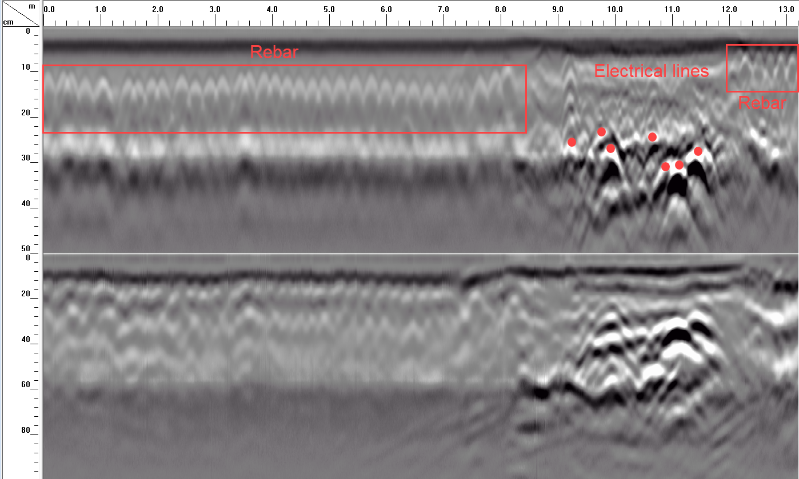
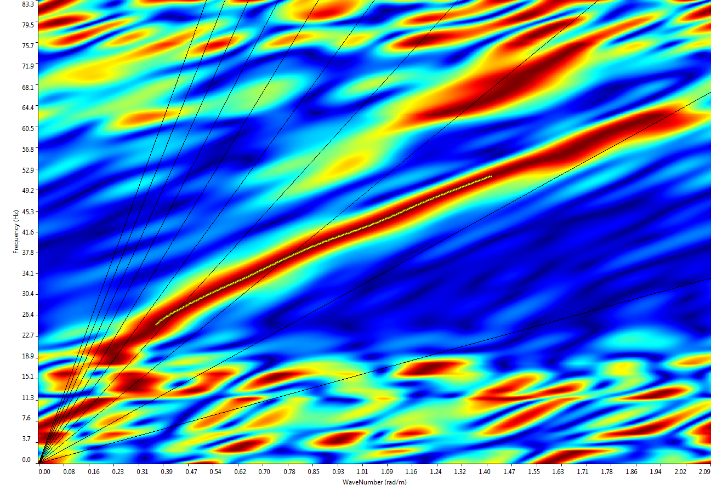
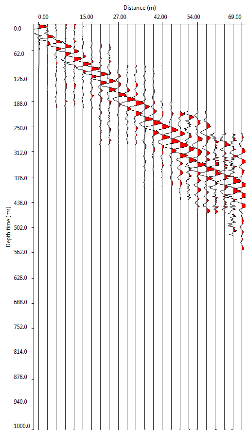
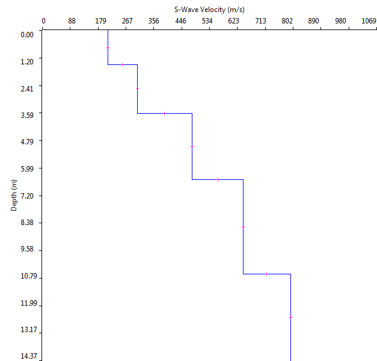
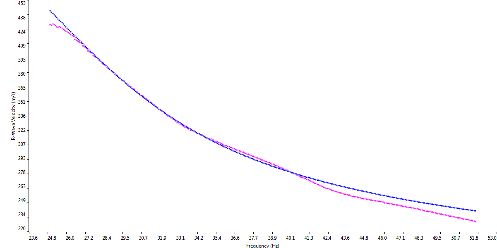

# Datasets
# 1. Ground Penetrating Radar (GPR)
RAW data of UtilityScan DF. Dual antenna ( 300 MHz and 800 MHz). Max Depth 7 m.

The UtilityScan DF is typically used for:

    Utility detection
    Environmental assessment
    Damage prevention
    Geological investigation
    Archaeology
    Forensics
    Road inspection
    
 

# 2. Multichannel Analysis of Surface Waves (MASW)
MASW is a nondestructive seismic method used to evaluate the shear-wave velocity distribution and arrangement of overburden soil deposits and the bedrock as well.  

It analyses dispersion properties of certain types of seismic surface waves (fundamental-mode Rayleigh waves) propagating horizontally along the surface of 
measurement directly from impact points to receivers (hammer shot points to geophones, respectively), or from passive noise sources such as traffic nearby. 
The method provides the shear wave (Vs) information in either 1D (depth) or 2D (depth and surface distance) formats.  The results can be used to estimate soil 
and rock strength (stiffness), determine the depth and topography of bedrock (even if bedrock is below water table), map subsurface geology (lateral and vertical variations), 
map low velocity layers, determine IBC Vs100 (Vs30) site classification, and aid in liquefaction potential analysis.

Typical applications of MASW include:

    Vs30 calculated for Seismic Site Classification (National Building Code);
    Bedrock profiling;
    Calculating elastic moduli and soil properties;
    Calculating soil damping ratios;
    Locating loose soil areas and soft clay areas;
    Mapping voids;
    Seismic shear-wave velocities for liquefaction analysis;
    Geological mapping.

### Spectrum

### Seismogram

### Profile

### Match

# 3. Cross-Hole

Crosshole (or “crosswell”) seismic measures the velocity of seismic waves between boreholes. There are two types of crosshole approaches. The conventional approach involves lowering a 3-component borehole geophone down one hole while lowering a source down an adjacent hole(s), firing the source at some prescribed depth interval. The source and geophone are always at the same elevation, and the energy from each shot is measured at a single depth in each receiver hole. The traveltimes are then converted to velocities by dividing them into the distance between the holes.

Common applications (in order of relative usefulness)

    Bridge/dam foundation analysis
    Insitu materials testing
    Soil and rock mechanics
    Earthquake engineering
    Liquefaction analysis

